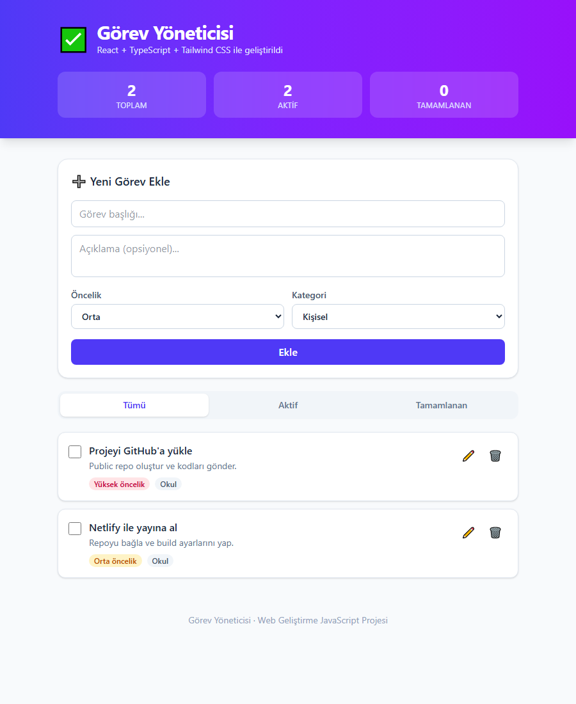

# 📋 Görev Yöneticisi (Task Manager)

Web Geliştirme – JavaScript eğitim programı bitirme projesi.
Modern bir frontend yığını kullanılarak geliştirilmiş, görevlerinizi
ekleyip listeleyebileceğiniz, güncelleyip silebileceğiniz bir **CRUD**
uygulamasıdır. Veriler tarayıcının **LocalStorage**'ında saklanır, bu
yüzden sayfa yenilense bile görevler kaybolmaz.

## 🚀 Canlı Demo

- **Netlify:** _(yayına aldıktan sonra buraya linki ekleyin)_

## 🖼️ Ekran Görüntüsü



## 🛠️ Kullanılan Teknolojiler

- **React** (JavaScript kütüphanesi)
- **TypeScript**
- **Vite** (build aracı / geliştirme sunucusu)
- **Tailwind CSS** (stil)
- **LocalStorage** (veri saklama)

## ✨ Özellikler (CRUD)

| İşlem | Açıklama |
| --- | --- |
| ➕ **Ekle** | Başlık, açıklama, öncelik ve kategori ile yeni görev oluşturma |
| 📄 **Listele** | Görevleri kart olarak listeleme + Tümü / Aktif / Tamamlanan filtreleri |
| ✏️ **Güncelle** | Mevcut görevi düzenleme ve tamamlandı olarak işaretleme |
| 🗑️ **Sil** | Görevi listeden kaldırma |

## 📂 Klasör Yapısı

```
src/
├── components/      # Yeniden kullanılabilir bileşenler
│   ├── Header.tsx
│   ├── TaskForm.tsx
│   ├── TaskItem.tsx
│   ├── TaskList.tsx
│   └── FilterBar.tsx
├── pages/           # Sayfalar
│   └── HomePage.tsx
├── interfaces/      # TypeScript tip tanımları
│   └── Task.ts
├── hooks/           # Özel React hook'ları
│   └── useLocalStorage.ts
├── App.tsx
└── main.tsx
```

## 💻 Kurulum ve Çalıştırma

Projeyi yerel makinenizde çalıştırmak için:

```bash
# Bağımlılıkları yükle
npm install

# Geliştirme sunucusunu başlat (http://localhost:5173)
npm run dev

# Üretim için derle
npm run build

# Derlenmiş çıktıyı önizle
npm run preview
```

## 🌐 Netlify ile Yayına Alma

1. Projeyi GitHub'a yükleyin (aşağıdaki adımlar).
2. [netlify.com](https://www.netlify.com) → **Add new site → Import an existing project**.
3. GitHub reponuzu seçin.
4. Ayarlar otomatik gelir (`netlify.toml` dosyası sayesinde):
   - **Build command:** `npm run build`
   - **Publish directory:** `dist`
5. **Deploy** → birkaç dakika içinde siteniz yayında.

---

Geliştirici: **Yusuf Eren Dokumacı** · Web Geliştirme JavaScript Projesi
